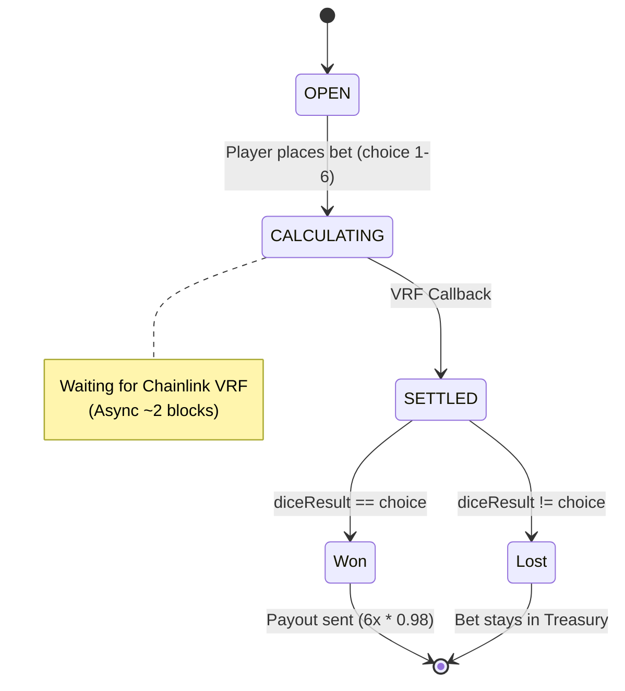
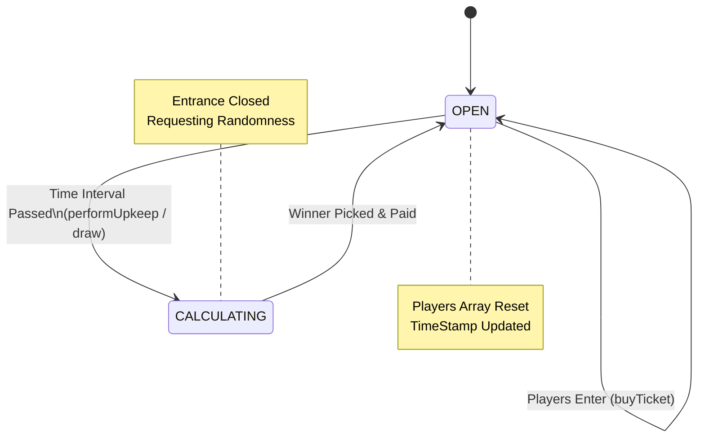

# Architecture & System Design

## 1. Project Overview
**Project Name**:Trustless Gaming: An On-Chain Verifiable Randomness Platform
**Type**: Option 4 (Verifiable Randomness Game)

This platform demonstrates a secure, transparent, and verifiable gaming ecosystem built on Ethereum (Sepolia Testnet). It leverages **Chainlink VRF (Verifiable Random Function)** to ensure true randomness for all game outcomes, decoupling the RNG (Random Number Generation) logic from the game mechanics.

The system consists of two distinct games:
1.  **DiceGame**: A player-vs-house betting game with instant settlement.
2.  **Raffle**: A pooled lottery system where users buy tickets and a winner is drawn periodically.

---

## 2. System Components

The architecture follows a modular design to ensure security and upgradeability.

### 2.1 Smart Contracts
* **`platform/RandomnessProvider.sol`**:
    * The core infrastructure layer. It acts as the **VRF Consumer**, wrapping the Chainlink Coordinator interactions.
    * **Role**: Receives randomness requests from authorized games, forwards them to Chainlink, and routes the callback to the specific game contract.
* **`platform/Treasury.sol`**:
    * The vault managing the platform's liquidity.
    * **Role**: Holds all funds. Only authorized Game contracts can request payouts to winners. Separates fund management from game logic.
* **`games/DiceGame.sol`**:
    * **Logic**: Users bet on a dice roll outcome (1-6). Win if the dice result matches their choice.
    * **Flow**: Immediate `requestRandomWords` upon betting.
* **`games/Raffle.sol`**:
    * **Logic**: Users buy tickets to enter a pool.
    * **Flow**: Round-based. A keeper or admin triggers the draw, which requests randomness to select a winner index.

### 2.2 Frontend
* **Tech Stack**: Next.js, Wagmi, Viem, TailwindCSS.
* **Role**: Provides a user interface for wallet connection, game interaction, and event monitoring (listening for `RequestSent` and `WinnerPicked` events).

---

## 3. System Architecture Diagram

This diagram illustrates the interaction between the User, our Protocol Contracts, and the external Chainlink Oracle.

## 4. Key Workflows

This section details the interaction flow for the two implemented games.

### 4.1 DiceGame: Instant Settlement Flow
The DiceGame allows users to bet on a dice roll outcome (1-6).

1.  **Bet Placement**:
    * User calls `DiceGame.placeBet(choice)` sending ETH (e.g., 0.01 ETH), where `choice` is a number from 1 to 6.
    * Contract verifies `msg.value` limits (min/max bet) and validates choice (1-6).
    * Bet amount is immediately transferred to Treasury.
    * **Event**: Emits `BetPlaced(betId, player, amount, choice, timestamp)`.
2.  **Randomness Request**:
    * `DiceGame` invokes `RandomnessProvider.requestRandomWords()`.
    * `RandomnessProvider` calls the **Chainlink VRF Coordinator**.
    * **Event**: Emits `RandomnessRequested(betId, requestId)`.
3.  **Fulfillment (Callback)**:
    * Chainlink VRF returns a random number via `rawFulfillRandomWords`.
    * `RandomnessProvider` routes the callback to `DiceGame.fulfillRandomness()`.
4.  **Settlement**:
    * **Logic**: `diceResult = (randomness % 6) + 1` (generates 1-6).
    * **Win Condition**: If `diceResult == choice`, the player wins.
    * **Payout**: If won, `DiceGame` calls `Treasury.payout(player, betAmount * 6 * 0.98)` (6x multiplier with 2% house edge).
    * **Event**: Emits `BetSettled(betId, player, diceResult, won, payout)`.

### 4.2 Raffle: Pooled Lottery Flow
The Raffle game accumulates tickets and picks one winner periodically.

1.  **Entry**:
    * User calls `enterRaffle()` with the entrance fee.
    * Address is added to the current round's `players` array.
2.  **Trigger (Draw)**:
    * Condition: `(block.timestamp - round.startTime) > i_interval`.
    * Chainlink Automation calls `performUpkeep()`.
    * Contract changes state to `CALCULATING`.
3.  **Randomness & Selection**:
    * Provider requests randomness.
    * On callback: `indexOfWinner = randomness % round.players.length`.
    * Winner is set to `round.players[indexOfWinner]`.
4.  **Payout**:
    * The entire prize pool is transferred to the winner via `Treasury`.
    * New round starts with empty players array. State returns to `OPEN`.

---

## 5. State Machine Diagrams

The following diagrams illustrate the lifecycle of a game request.

### 5.1 DiceGame Request Lifecycle

### 5.2 Raffle Game Lifecycle

The Raffle game operates in a continuous loop. It remains open for new players until a specific time interval has passed, at which point it locks to select a winner.

## 6. VRF Configuration (Sepolia Testnet)

The platform is configured to use **Chainlink VRF V2.5** on the Sepolia test network. These parameters govern the security and gas limits of the randomness requests.

| Parameter | Value (Sepolia) | Description |
| :--- | :--- | :--- |
| **VRF Coordinator** | `0x9DdfaCa8183c41ad55329BdeeD9F6A8d53168B1B` | The address of the Chainlink VRF V2.5 Coordinator contract. |
| **Key Hash (Gas Lane)** | `0x787d74caea10b2b357790d5b5247c2f63d1d91572a9846f780606e4d953677ae` | 500 gwei Key Hash. Determines the maximum gas price for the callback transaction. |
| **Subscription ID** | `37343118368090211153610401976496944694401828535371594389547337555701187037682` | VRF V2.5 subscription ID (funded with ETH). |
| **Callback Gas Limit** | `500,000` | The limit of gas the callback function (`fulfillRandomWords`) can consume. |
| **Request Confirmations** | `3` | The number of blocks the VRF waits before generating the random number (security buffer). |

---

## 7. Deployment Information

> **Note**: This section acts as a registry for our deployed contracts. It will be updated after the final deployment script execution.

| Contract | Address |
| :--- | :--- |
| **Network** | **Sepolia Testnet** (Chain ID: 11155111) |
| **RandomnessProvider** | `0x8E03083aF8CCb5b45Dd0fFf12dd45682403dDd5e` |
| **Treasury** | `0xF062f2A710A9a5dcA35fE0b4280BECf32394C78f` |
| **DiceGame** | `0xDb27dF37443269FD927463aFdE3D115Dc63cEE93` |
| **Raffle** | `0x4E8e5BB5B7f4AE47BBDD9e006E832199dbe68131` |

### Post-Deployment Checklist
- [x] Contracts verified on Etherscan
- [x] VRF Subscription funded with ETH
- [x] `RandomnessProvider` added as a Consumer to the VRF Subscription
- [x] `DiceGame` and `Raffle` authorized in `RandomnessProvider`