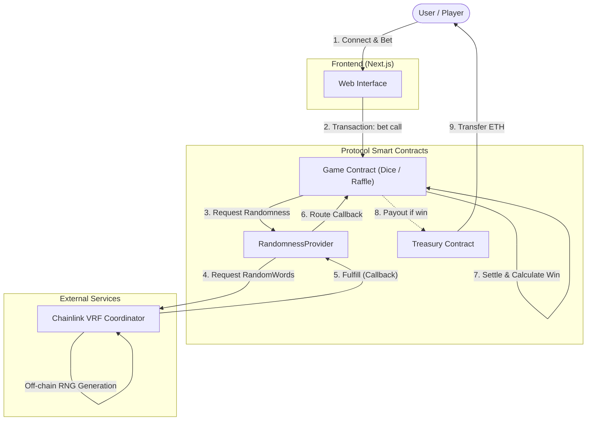
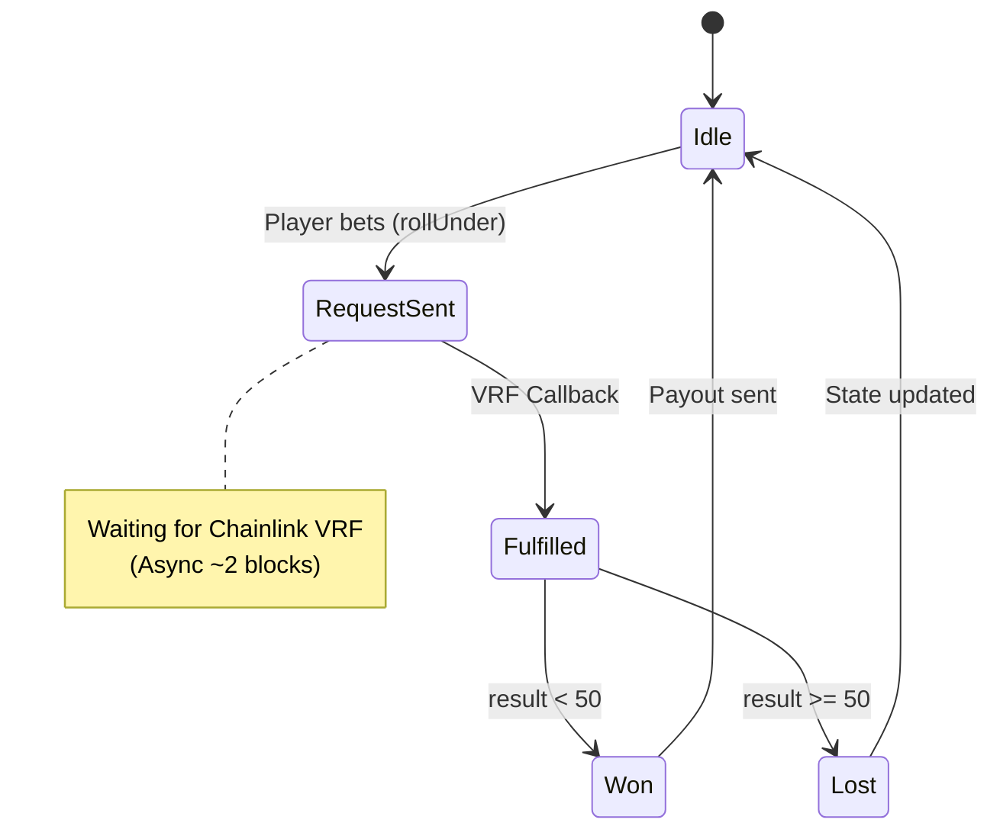
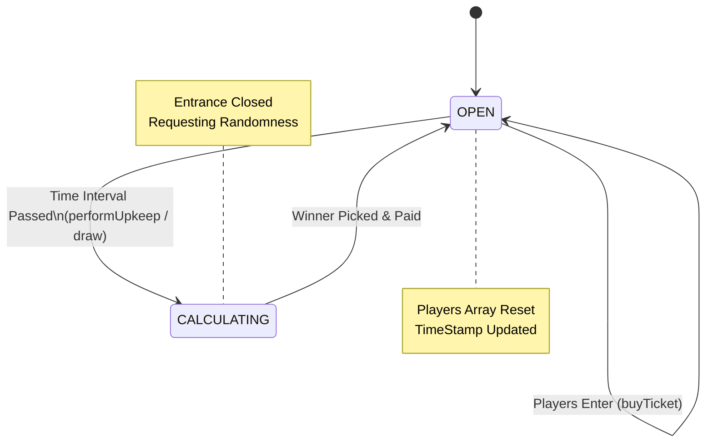

# Architecture & System Design

## 1. Project Overview
**Project Name**: Decentralized Randomness Gaming Platform
**Type**: Option 4 (Verifiable Randomness Game)

This platform demonstrates a secure, transparent, and verifiable gaming ecosystem built on Ethereum (Sepolia Testnet). It leverages **Chainlink VRF (Verifiable Random Function)** to ensure true randomness for all game outcomes, decoupling the RNG (Random Number Generation) logic from the game mechanics.

The system consists of two distinct games:
1.  **DiceGame**: A player-vs-house betting game with instant settlement.
2.  **Raffle**: A pooled lottery system where users buy tickets and a winner is drawn periodically.

---

## 2. System Components

The architecture follows a modular design to ensure security and upgradeability.

### 2.1 Smart Contracts
* **`platform/RandomnessProvider.sol`**:
    * The core infrastructure layer. It acts as the **VRF Consumer**, wrapping the Chainlink Coordinator interactions.
    * **Role**: Receives randomness requests from authorized games, forwards them to Chainlink, and routes the callback to the specific game contract.
* **`platform/Treasury.sol`**:
    * The vault managing the platform's liquidity.
    * **Role**: Holds all funds. Only authorized Game contracts can request payouts to winners. Separates fund management from game logic.
* **`games/DiceGame.sol`**:
    * **Logic**: Users bet on specific outcomes (e.g., Roll < 50).
    * **Flow**: Immediate `requestRandomWords` upon betting.
* **`games/Raffle.sol`**:
    * **Logic**: Users buy tickets to enter a pool.
    * **Flow**: Round-based. A keeper or admin triggers the draw, which requests randomness to select a winner index.

### 2.2 Frontend
* **Tech Stack**: Next.js, Wagmi, Viem, TailwindCSS.
* **Role**: Provides a user interface for wallet connection, game interaction, and event monitoring (listening for `RequestSent` and `WinnerPicked` events).

---

## 3. System Architecture Diagram

This diagram illustrates the interaction between the User, our Protocol Contracts, and the external Chainlink Oracle.

## 4. Key Workflows

This section details the interaction flow for the two implemented games.

### 4.1 DiceGame: Instant Settlement Flow
The DiceGame allows users to bet on whether a random number (1-100) will be lower than a threshold (50).

1.  **Bet Placement**:
    * User calls `DiceGame.rollUnder(50)` sending ETH (e.g., 0.01 ETH).
    * Contract verifies `msg.value` limits and Treasury solvency.
    * **Event**: Emits `RollRequested(requestId, player, amount, rollUnder)`.
2.  **Randomness Request**:
    * `DiceGame` invokes `RandomnessProvider.requestRandomWords()`.
    * `RandomnessProvider` calls the **Chainlink VRF Coordinator**.
3.  **Fulfillment (Callback)**:
    * Chainlink VRF returns a random number via `rawFulfillRandomWords`.
    * `RandomnessProvider` routes the callback to `DiceGame.fulfillRandomness()`.
4.  **Settlement**:
    * **Logic**: `result = (randomWord % 100) + 1`.
    * **Win Condition**: If `result < 50`, the player wins.
    * **Payout**: `DiceGame` calls `Treasury.payout(player, winAmount)`.
    * **Event**: Emits `RollSettled(requestId, winner, payout)`.

### 4.2 Raffle: Pooled Lottery Flow
The Raffle game accumulates tickets and picks one winner periodically.

1.  **Entry**:
    * User calls `enterRaffle()` with the entrance fee.
    * Address is added to the `s_players` array.
2.  **Trigger (Draw)**:
    * Condition: `(block.timestamp - s_lastTimeStamp) > i_interval`.
    * Admin or Chainlink Keepers call `performUpkeep()` (or `requestRandomWinner`).
    * Contract changes state to `CALCULATING`.
3.  **Randomness & Selection**:
    * Provider requests randomness.
    * On callback: `indexOfWinner = randomWord % s_players.length`.
    * `recentWinner` is set to `s_players[indexOfWinner]`.
4.  **Payout**:
    * The entire contract balance (minus fees) is transferred to the winner via `Treasury`.
    * Array `s_players` is reset. State returns to `OPEN`.

---

## 5. State Machine Diagrams

The following diagrams illustrate the lifecycle of a game request.

### 5.1 DiceGame Request Lifecycle

### 5.2 Raffle Game Lifecycle

The Raffle game operates in a continuous loop. It remains open for new players until a specific time interval has passed, at which point it locks to select a winner.

## 6. VRF Configuration (Sepolia Testnet)

The platform is configured to use **Chainlink VRF V2** on the Sepolia test network. These parameters govern the security and gas limits of the randomness requests.

| Parameter | Value (Sepolia) | Description |
| :--- | :--- | :--- |
| **VRF Coordinator** | `0x8103B0A8A00be2DDC778e6e7eaa21791Cd364625` | The address of the Chainlink VRF Coordinator contract. |
| **Key Hash (Gas Lane)** | `0x474e34a077df58807dbe9c96d3cabb68bd679f00705f1452547e333b1e4ac666` | 150 gwei Key Hash. Determines the maximum gas price for the callback transaction. |
| **Subscription ID** | `[REPLACE_WITH_YOUR_ID]` | **TODO**: Update this after creating and funding a subscription on vrf.chain.link. |
| **Callback Gas Limit** | `500,000` | The limit of gas the callback function (`fulfillRandomWords`) can consume. |
| **Request Confirmations** | `3` | The number of blocks the VRF waits before generating the random number (security buffer). |

---

## 7. Deployment Information

> **Note**: This section acts as a registry for our deployed contracts. It will be updated after the final deployment script execution.

| Contract | Address |
| :--- | :--- |
| **Network** | **Sepolia Testnet** (Chain ID: 11155111) |
| **RandomnessProvider** | `0x...` |
| **Treasury** | `0x...` |
| **DiceGame** | `0x...` |
| **Raffle** | `0x...` |

### Post-Deployment Checklist
- [ ] Contracts verified on Etherscan?
- [ ] VRF Subscription funded with LINK?
- [ ] `RandomnessProvider` added as a Consumer to the VRF Subscription?
- [ ] `DiceGame` and `Raffle` authorized in `RandomnessProvider`?