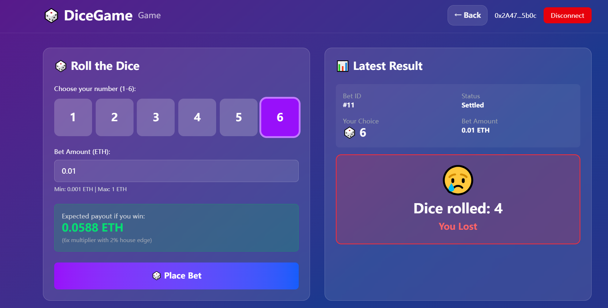
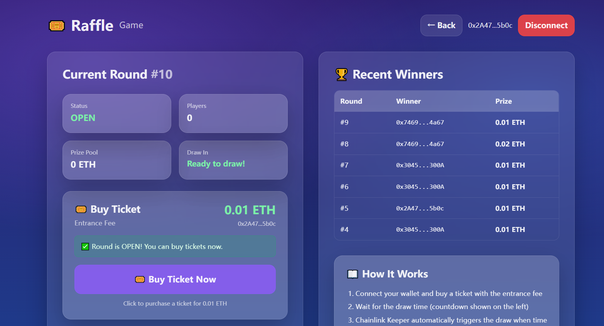

# Test & Coverage Report

**Project Name**:Trustless Gaming: An On-Chain Verifiable Randomness Platform
**Type**: Option 4 (Verifiable Randomness Game)

---

## 1. Testing Goals & Scope

### Testing Goals
- Achieve **>=80% local line coverage** for Solidity contracts.
- Provide required test types:
  - **Unit tests**
  - **Integration tests**
  - **Invariant / fuzz-style tests**
  - **Gas optimization tests**
- (If feasible) Provide **testnet acceptance evidence** using real Chainlink VRF (addresses + tx hashes + events).

### Scope
- **Included (tests + coverage):** contracts under `contracts/src/**`
- **Not included in coverage:** `scripts/` and `frontend/`
- **Frontend validation:** manual functional checks

---

## 2. Project Under Test (Repo Structure)

### Contracts
- Games:
  - `contracts/src/games/DiceGame.sol`
  - `contracts/src/games/Raffle.sol`
- Platform:
  - `contracts/src/platform/RandomnessProvider.sol`
  - `contracts/src/platform/Treasury.sol`
- Local mock (Hardhat-only):
  - `contracts/src/mocks/VRFCoordinatorMock.sol`

### Tests (Hardhat)
- Games:
  - `contracts/test/games/DiceGame.test.ts`
  - `contracts/test/games/Raffle.test.ts`
- Platform:
  - `contracts/test/platform/RandomnessProvider.test.ts`
  - `contracts/test/platform/Treasury.test.ts`
- End-to-end sanity:
  - `contracts/test/smoke.test.ts`
- Invariant-style checks:
  - `contracts/test/invariants.test.ts`
- Gas measurements (receipt-based):
  - `contracts/test/gas.test.ts`

---

## 3. Tooling & Environments

### Local (for coverage + most tests)
- Framework: **Hardhat** (TypeScript tests)
- Coverage: **solidity-coverage**
- Randomness: **VRFCoordinatorMock** used to simulate fulfillment locally

### Testnet (for acceptance evidence)
- Network: Sepolia
- Randomness: **Real Chainlink VRF**
- Evidence format: contract addresses + tx hashes + explorer links + emitted events

---

## 4. How to Run (Local)

### Install & Compile
```bash
npm install
npx hardhat compile
```

### Run Tests

```bash
npx hardhat test
```

### Run Coverage (>=80% line coverage)

```bash
npx hardhat coverage
```

* Output: `coverage/` and `coverage/lcov-report/`

### Gas Measurement (for gas optimization requirement)

* Method: Local receipt-based gas snapshots using `txReceipt.gasUsed` (Hardhat), implemented in `contracts/test/gas.test.ts`
* Output/Evidence: Console output table from `npx hardhat test contracts/test/gas.test.ts` (screenshot/log) + gas table recorded in Section 5.4

---

# Part A — Local Testing & Coverage (Hardhat + Mock VRF)

## 5. Test Plan by Category

### 5.1 Unit Tests
Unit tests are implemented per-module (games/platform) under Hardhat. Local randomness is driven deterministically via `VRFCoordinatorV2Mock`.

- `test/platform/RandomnessProvider.test.ts` — unit tests for VRF request/fulfillment path.  
  Coverage: 100% stmts/branches/funcs/lines.

- `test/platform/Treasury.test.ts` — unit tests for treasury access control and payout/withdraw behaviors.  
  Coverage: 96.77% lines (uncovered: 104).

- `test/games/DiceGame.test.ts` — unit tests for bet lifecycle (input guards, request→settle linkage).  
  Coverage: 98.36% lines (uncovered: 278).

- `test/games/Raffle.test.ts` — unit tests for raffle lifecycle (entry rules, upkeep/draw gating, winner finalization).  
  Coverage: 87.32% lines (uncovered: 287–289).

### 5.2 Integration Tests (End-to-End)
End-to-end sanity is verified via `contracts/test/smoke.test.ts` across  
**Game ↔ RandomnessProvider ↔ VRFCoordinatorV2Mock ↔ Treasury**:

- Dice: `placeBet` → request randomness → mock fulfill → round/bet reaches settled state.
- Raffle: `enterRaffle` → time elapse → `performUpkeep` → mock fulfill → winner is produced and state returns to OPEN.

### 5.3 Invariant-Style Checks
Invariant-style properties are enforced via dedicated assertions in `contracts/test/invariants.test.ts` (Hardhat + `VRFCoordinatorV2Mock`):

- **INV-1 Treasury permissioning:** `Treasury.payout` rejects unauthorized callers (revert asserted).
- **INV-2 Raffle state machine:** `performUpkeep` reverts when upkeep conditions are not met.
- **INV-3 One-time VRF consumption (Dice):** the same `requestId` cannot be fulfilled twice; repeated fulfillment is rejected and the bet remains settled.
- **INV-4 End-to-end lifecycle integrity (Raffle):** enter → upkeep → VRF fulfill completes a round, records a non-zero winner, and resets the raffle state to `OPEN`.
- **INV-5 Repeated trials (Dice):** multiple randomized bets settle successfully without breaking core state (player linkage and settled status).

### 5.4 Gas Optimization Tests / Measurements
Gas is measured locally on Hardhat using `txReceipt.gasUsed` (`contracts/test/gas.test.ts`).

| Operation | GasUsed (local) |
| --- | ---: |
| Dice.placeBet | 329,469 |
| VRF.fulfillRandomWords (Dice path) | 65,201 |
| Raffle.enterRaffle (p1) | 95,904 |
| Raffle.enterRaffle (p2) | 61,704 |
| Raffle.performUpkeep | 148,717 |
| VRF.fulfillRandomWords (Raffle path) | 172,681 |
| Treasury.adminWithdraw | 34,970 |

Notes: these numbers are collected on the local Hardhat network; gas on testnet may vary due to network/basefee and warm/cold storage effects.

---

## 6. Feature → Test Mapping (by file)

- `contracts/src/games/DiceGame.sol`
  - Unit: `test/games/DiceGame.test.ts`
  - E2E sanity: `contracts/test/smoke.test.ts`
  - Invariants: `contracts/test/invariants.test.ts`

- `contracts/src/games/Raffle.sol`
  - Unit: `test/games/Raffle.test.ts`
  - E2E sanity: `contracts/test/smoke.test.ts`
  - Invariants: `contracts/test/invariants.test.ts`

- `contracts/src/platform/RandomnessProvider.sol`
  - Unit: `test/platform/RandomnessProvider.test.ts`
  - E2E sanity: `contracts/test/smoke.test.ts` (via VRF fulfillment paths)

- `contracts/src/platform/Treasury.sol`
  - Unit: `test/platform/Treasury.test.ts`
  - Invariants: `contracts/test/invariants.test.ts` (permissioning checks)

- Gas measurements (hot paths snapshot)
  - `contracts/test/gas.test.ts`

---

## 7. Coverage Report

**Tooling:** Hardhat + `solidity-coverage`  
**Command:** `npx hardhat coverage`

### Coverage Summary (All files)

- Statements: **86.52%**
- Branches: **67.65%**
- Functions: **84.44%**
- Lines: **89.74%** (meets >=80% requirement)

### Per-Contract Coverage

| Contract                          | % Stmts | % Branch | % Funcs | % Lines | Uncovered lines |
| --------------------------------- | ------: | -------: | ------: | ------: | --------------- |
| `games/DiceGame.sol`              |   97.62 |    82.14 |   92.31 |   98.36 | 278             |
| `games/Raffle.sol`                |   83.02 |    61.54 |   80.00 |   87.32 | 287–289         |
| `mocks/VRFCoordinatorMock.sol`    |   52.94 |    30.00 |   50.00 |   60.87 | 144, 163, 164   |
| `platform/RandomnessProvider.sol` |  100.00 |   100.00 |  100.00 |  100.00 | —               |
| `platform/Treasury.sol`           |   96.00 |    71.05 |   90.00 |   96.77 | 104             |

Note: `mocks/VRFCoordinatorMock.sol` is a local-only test utility. Our tests exercise only the fulfillment paths required by Dice/Raffle flows; therefore some defensive branches in the mock remain uncovered. This does not affect production contracts’ coverage or correctness.

---

# Part B — Testnet Acceptance / Smoke Validation (Sepolia + Real Chainlink VRF)

## 8. Environment

- Network: **Sepolia** (chainId: **11155111**)
- Frontend URL: **https://sc6107.vercel.app/**
- RPC (used by frontend): `https://sepolia.infura.io/v3/941934a6ae0c419788b4d8a24f5a77cc`
- VRF mode: **Real Chainlink VRF on testnet** (asynchronous callback)

## 9. Deployed Contracts (Sepolia)

| Component | Address |
| --- | --- |
| Treasury | `0xF062f2A710A9a5dcA35fE0b4280BECf32394C78f` |
| RandomnessProvider | `0x8E03083aF8CCb5b45Dd0fFf12dd45682403dDd5e` |
| Raffle | `0x4E8e5BB5B7f4AE47BBDD9e006E832199dbe68131` |
| DiceGame | `0xDb27dF37443269FD927463aFdE3D115Dc63cEE93` |

VRF configuration (Sepolia):
- VRF Coordinator: **0x9DdfaCa8183c41ad55329BdeeD9F6A8d53168B1B**
- Subscription ID (subId): **3066552608327859797891664654094611013914157956849122446945087242953245848080**
- KeyHash / gasLane: **787D74CAEA10B2B357790D5B5247C2F63D1D91572A9846F780606E4D953677AE**
- callbackGasLimit: **500000**
- requestConfirmations: **3**

## 10. Acceptance Goals (Testnet)

The goal of testnet validation is to confirm that the end-to-end lifecycle works under a real VRF coordinator:
1) User-triggered transactions succeed from the frontend on Sepolia.
2) A randomness request is successfully created on-chain.
3) Chainlink fulfills the request asynchronously (VRF callback tx occurs).
4) The target game contract finalizes correctly:
   - Dice: bet settles after fulfillment.
   - Raffle: winner is selected and the raffle state resets for the next round.
5) The final states are observable either via the UI or via on-chain calls/events.

## 11. Testnet Smoke Scenarios (Evidence-Based)

> Evidence for each scenario includes: (i) user transaction hash that triggers the request, and (ii) VRF fulfillment transaction hash generated by Chainlink.

### Scenario 1 — Dice (Real VRF)

**Preconditions**
- Wallet connected to Sepolia in MetaMask.
- DiceGame contract address configured in frontend.

**Steps**
1. Open the dApp: https://sc6107.vercel.app/ and connect wallet (Sepolia).
2. Navigate to the Dice page.
3. Place a bet (select a valid choice; send the required bet amount).
4. Wait for VRF fulfillment (asynchronous callback on Sepolia).

**Expected**
- The bet transaction is confirmed on Sepolia.
- A randomness request is created (visible in transaction logs / contract state).
- After VRF callback, the bet transitions to a settled/finalized state and the outcome is visible (UI and/or contract state).

**Evidence (Explorer)**
- Dice request tx (user): **0x2729be9d564eec210a444a4ca29c5662580a0ef79f130fb8f32794ae51ae82a0**
- Dice VRF fulfill tx (Chainlink callback): **[PASTE TX HASH]**
- Bet result: ****

---

### Scenario 2 — Raffle (Real VRF)

**Preconditions**
- Wallet connected to Sepolia in MetaMask.
- Raffle contract address configured in frontend.

**Steps**
1. Open the dApp and connect wallet (Sepolia).
2. Navigate to the Raffle page.
3. Enter the raffle by paying the entrance fee (confirm tx).
4. After the interval passes, trigger `performUpkeep`.
5. Wait for VRF fulfillment callback.

**Expected**
- Entry transaction is confirmed and the player is included.
- Upkeep/request transaction succeeds, creating a randomness request.
- After VRF callback:
  - A non-zero winner address is recorded.
  - Raffle state resets to OPEN (ready for next round).

**Evidence (Explorer)**
- Raffle request tx (user): **0x2726ae94230b34e24c7b3451c3e77f17ee7f90f97c5d5da1ecde4898b8ae8792**
- Raffle result: ****

## 12. Notes / Limitations

- Testnet validation is an acceptance-level smoke check with real VRF; local unit/invariant/coverage tests remain the primary correctness baseline (see Part A).
- VRF fulfillment is asynchronous and depends on testnet conditions; callback timing may vary.
- Gas and coverage numbers are reported from local Hardhat tests (Part A). Testnet fees/cost may vary due to basefee and network conditions.
